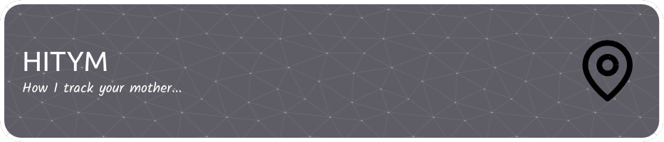
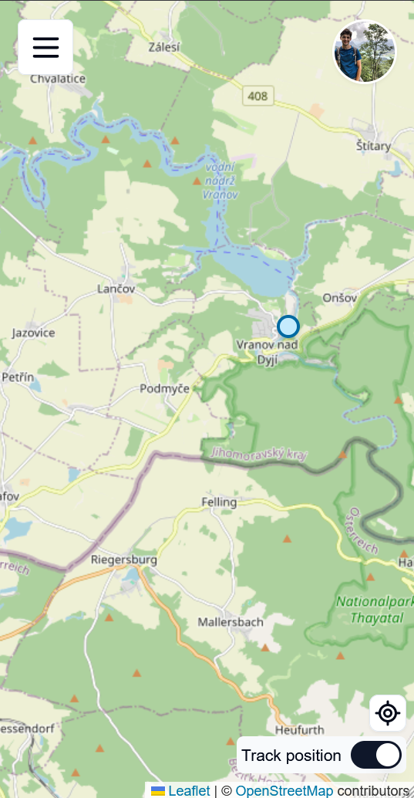
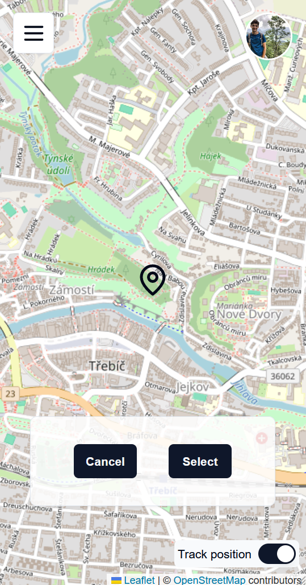
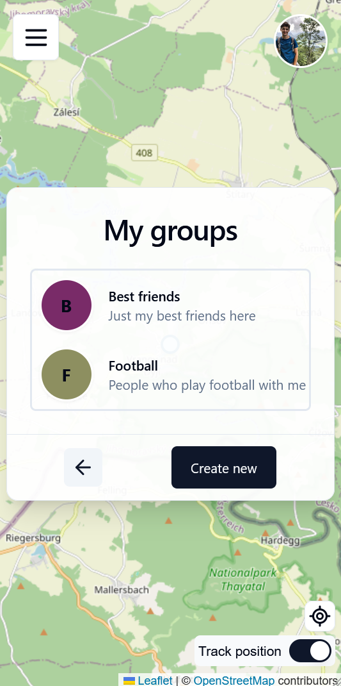
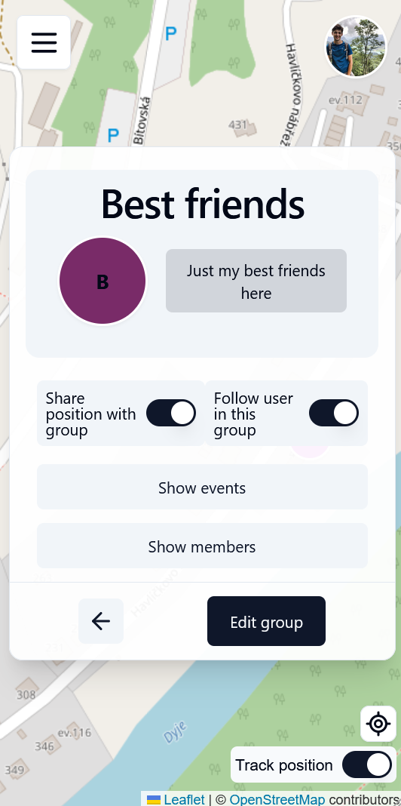
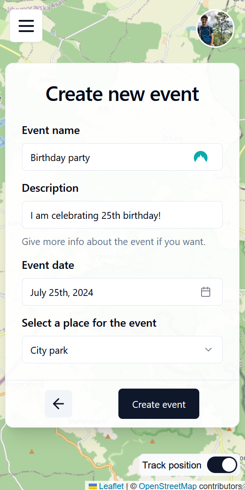
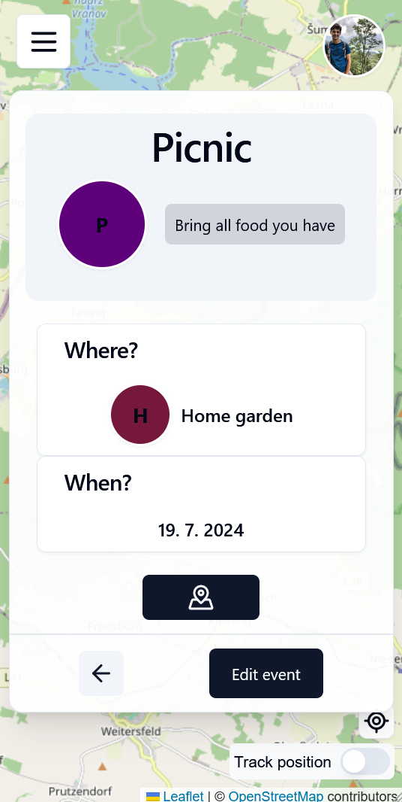
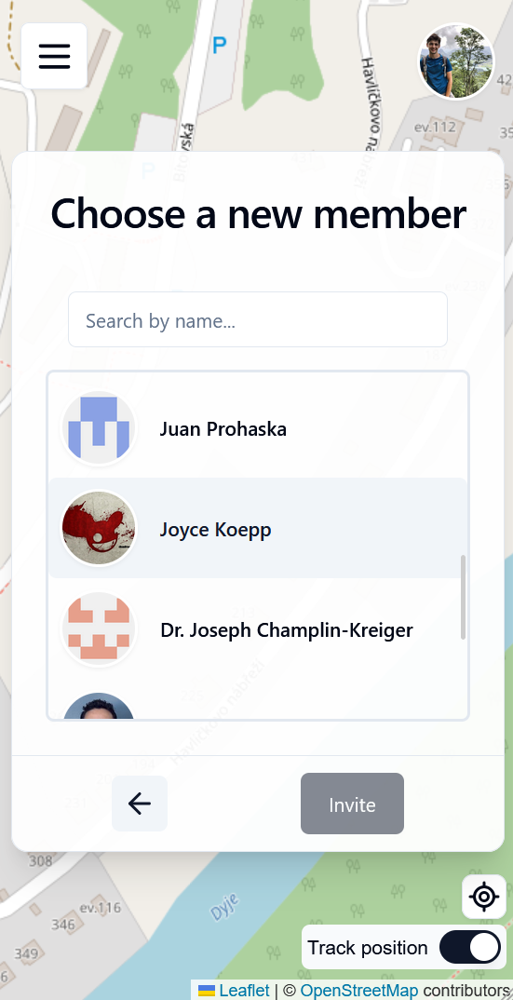

---

### Application for tracking friends (and your mom).

Have you ever lost your friends at some big event, or do you have a friend that gets always lost? Then this application is made exactly for you. With this app, you can see the current location of selected friends with the help of an interactive map. You can make friend groups to share positions with all of the group members and even plan group events. Each user can also add a custom status that everybody else can see.

If you use this app, you will never be lost again!

### ENTITIES:

- User - Describes user and its properties
- Group - Group of users sharing some data
- Place - Certain position on the map with special meaning
- UserStatus - User defined state (similar to Instagram "note" or discord status)
- GroupEvent - Event(time and place) shared inside group


### How to run the app
 1. Install dependencies:
    ```
    npm install
    ```
 2. Create .env files in */apps/api* and */apps/web*. There are env.example files already.
 3. Create a container for the postgres database:
    ```
    docker-compose up
    ```
 3. In folder */apps/api/prisma*, run prisma migrations:
    ```
    npm run migrate:up
    ```
 4. In project root folder, start the app:
    ```
    npm run dev
    ```

Client is accessible on *http://localhost:5173/*.

API docs are accessible on *http://localhost:3000/api-docs/*.

### Few examples from the app
The app is intended mainly for mobile phones.
#### Home page


#### Creating new place, selecting position on map


#### Listing your groups


#### Info about the group


#### Creating group event


#### Info about the group event, possibility to navigate (via Google Maps) to the event place


#### Invite new member to group
